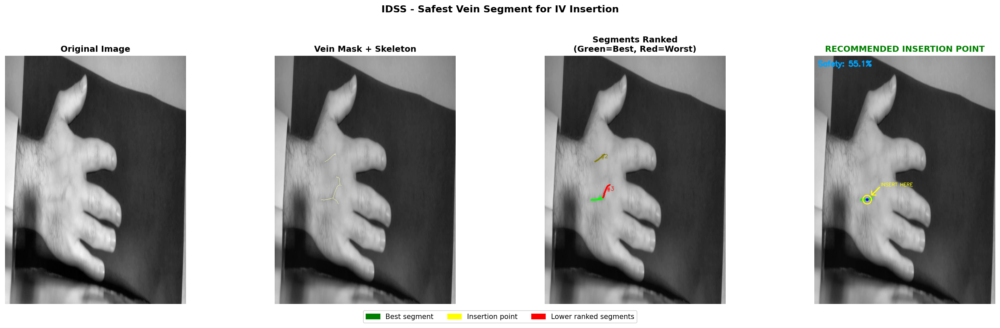
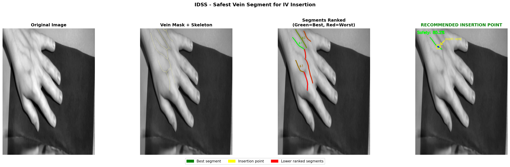
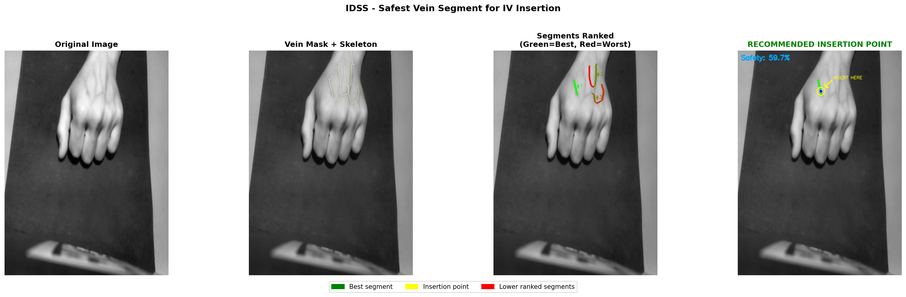

# IDSS — Intelligent Decision Support System for IV Insertion

An AI-powered pipeline that identifies the **safest vein segment** on a patient's hand for intravenous (IV) catheter insertion. The system uses deep learning segmentation combined with clinical knowledge rules and multi-criteria decision analysis to recommend an optimal insertion point.

---

## How It Works

```
Hand Image / Video
       │
       ▼
  UNet++ Model          ← vein segmentation (probability map)
       │
       ▼
  Skeletonization       ← extract vein centerlines
       │
       ▼
  Feature Extraction    ← length, diameter, tortuosity, confidence, region
       │
       ▼
  Knowledge Rules       ← hard rejections + soft penalties/bonuses
       │
       ▼
  AHP + TOPSIS          ← multi-criteria ranking
       │
       ▼
  Insertion Point       ← recommended needle position (y, x)
       │
       ▼
  Visualization         ← annotated output image / video
```

---

## Pipeline Stages

| Stage | Module | Description |
|---|---|---|
| Segmentation | `main.py` / `main_video.py` | Loads UNet++ model, runs inference |
| Feature Extraction | `idss/features.py` | Measures length, diameter, tortuosity, confidence, branch distance, edge distance, region |
| Clinical Rules | `idss/rules.py` | Hard rejections (too short, too thin, low confidence, over wrist) + soft penalties/bonuses |
| AHP Weights | `idss/ahp.py` | Analytic Hierarchy Process — determines feature importance |
| Normalization | `idss/normalize.py` | Scales all features to 0.0–1.0 |
| TOPSIS Scoring | `idss/topsis.py` | Ranks segments by similarity to ideal vein |
| Insertion Point | `idss/insertion.py` | Picks the optimal needle position on the best segment |
| Visualization | `idss/visualize.py` | Draws overlay: vein mask, ranked segments, insertion marker |

---

## Clinical Decision Rules

### Hard Rejection Rules
| Rule | Threshold | Reason |
|---|---|---|
| Segment too short | < 30 px | No room for safe needle placement |
| Diameter too small | < 4 px | Catheter won't fit |
| Over wrist joint | — | Pain, high failure rate, catheter dislodgement |
| Low model confidence | < 0.60 | Detection may be unreliable |
| High confidence variation | > 20% | Weak/uncertain spot along the vein |

### Soft Penalty Rules
| Rule | Penalty | Reason |
|---|---|---|
| Close to branch point | ×0.60 | Risk of puncturing wrong vessel |
| Close to image edge | ×0.70 | May be partially cut off |
| High tortuosity | ×0.65 | Difficult needle threading |
| Endpoint near bifurcation | ×0.70 | Each endpoint must be ≥ 15 px from any junction |
| Proximal region (near wrist) | ×0.80 | Less preferred anatomical site |

### Bonus Rules
| Rule | Bonus | Reason |
|---|---|---|
| Far from branch points | ×1.15 | More room, lower risk |
| Very straight vein (tortuosity < 0.10) | ×1.10 | Highest insertion success rate |
| Distal dorsal hand region | ×1.20 | Preferred IV site |
| Middle hand region | ×1.05 | Acceptable IV site |
| High model confidence (≥ 0.95) | ×1.10 | Reliable detection |
| Long continuous segment (≥ 100 px) | ×1.10 | More insertion options |
| Both endpoints safely away from bifurcations | ×1.10 | Entire segment is safe |

---

## Configuration

All thresholds are centralized in `config.py`:

```python
# Model
MODEL_PATH     = "unetplusplus.pt"
IMAGE_H, IMAGE_W = 704, 512
THRESHOLD = 0.65            # segmentation confidence cutoff

# Clinical Thresholds
MIN_LENGTH_PX       = 30    # minimum vein length
MIN_DIAMETER_PX     = 4     # minimum vein diameter
MAX_TORTUOSITY      = 0.45  # maximum curvature
MIN_BRANCH_DIST_PX  = 15    # distance from branch point
MIN_EDGE_DIST_PX    = 20    # distance from image border
MIN_CONFIDENCE      = 0.60  # minimum model confidence

# Video Temporal Stability
REANALYZE_EVERY  = 5        # run IDSS every N frames
SMOOTH_WINDOW    = 12       # vote window size
MIN_VOTES_NEEDED = 5        # consensus threshold
```

---

## Usage

### Single Image
```bash
python main.py --image images/hand001.png
python main.py --image images/hand001.png --save outputs/result.png
```

### Folder of Images
```bash
python main.py --folder images/
```
Results are saved to `outputs/idss_<filename>.png` and `hamzah/<filename>.json`.

### Video
```bash
python vein_demo_v23_skeleton.py --video vein_recording_v2_50s.mp4 --save outputs/result.mp4
```

---

## Output Format

Each image run produces:
- **Annotated PNG** — 4-panel view: original, vein mask + skeleton, ranked segments, recommended insertion point
- **JSON report** — structured output for UI integration

```json
{
  "best_segment": { "segment_id": 3, "safety_score": 78.4, "rank": 1 },
  "insertion_point": { "x": 214, "y": 380, "confidence": 92.1 },
  "vein_metrics": {
    "length_px": 134.5,
    "diameter_px": 8.3,
    "tortuosity": 0.08,
    "region": "Distal"
  }
}
```

---

## Example Results

### Sample 1 — Dorsal Hand (Side View)


### Sample 2 — Dorsal Hand (Fingers Visible)


### Sample 3 — Dorsal Hand (Top View)


Each output panel shows (left to right):
1. **Original Image** — input grayscale hand image
2. **Vein Mask + Skeleton** — segmentation overlay with centerline
3. **Segments Ranked** — green = best, yellow = mid, red = lower ranked
4. **Recommended Insertion Point** — final decision with safety score and "INSERT HERE" marker

---

## Video Demo — Last 10 Seconds of `result_v2_50s.mp4`

The clip below shows the IDSS running on live video: real-time vein detection, temporal stabilization (voting across frames), and a locked insertion point that stays stable as the hand moves.

> `outputs/result_v2_last10s.mp4`

Key behaviors visible in the clip:
- **Blue overlay** — detected vein mask
- **Green path** — best ranked segment
- **Yellow dot + cyan circle** — recommended insertion point
- **Safety % score** — updated every 5 frames, stabilized over a 12-frame vote window

---

## Project Structure

```
Safest_Segment_IDSS/
├── config.py                  # all thresholds and parameters
├── main.py                    # image inference entry point
├── main_video.py              # video inference entry point
├── vein_demo_v23_skeleton.py  # demo script with skeleton overlay
├── idss/
│   ├── pipeline.py            # main orchestrator
│   ├── features.py            # feature extraction
│   ├── rules.py               # clinical knowledge rules
│   ├── ahp.py                 # AHP weight computation
│   ├── normalize.py           # feature normalization
│   ├── topsis.py              # TOPSIS ranking
│   ├── insertion.py           # insertion point finder
│   └── visualize.py           # result visualization
├── utils/
│   ├── preprocessing.py       # image preprocessing + CLAHE
│   └── skeleton.py            # skeletonization + graph extraction
├── images/                    # input hand images
├── outputs/                   # annotated results + videos
└── unetplusplus.pt            # trained segmentation model
```

---

## Dependencies

- Python 3.8+
- PyTorch
- OpenCV (`cv2`)
- scikit-image
- NumPy, pandas
